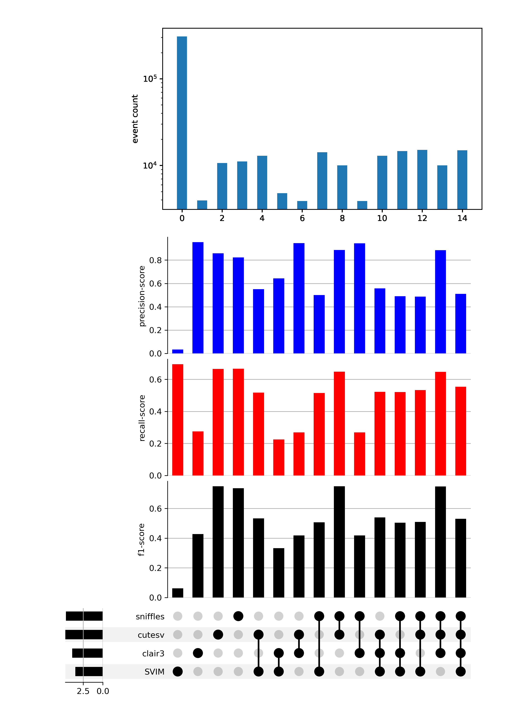

Pipeline for benchmarking variant-callers. Runs variant-callers included in
'call.wdl', combines results using SURVIVOR, and compares combinations to
a provided truth-set. 
F1-score, recall and precision of all combinations are plotted in an upsetPlot. 

