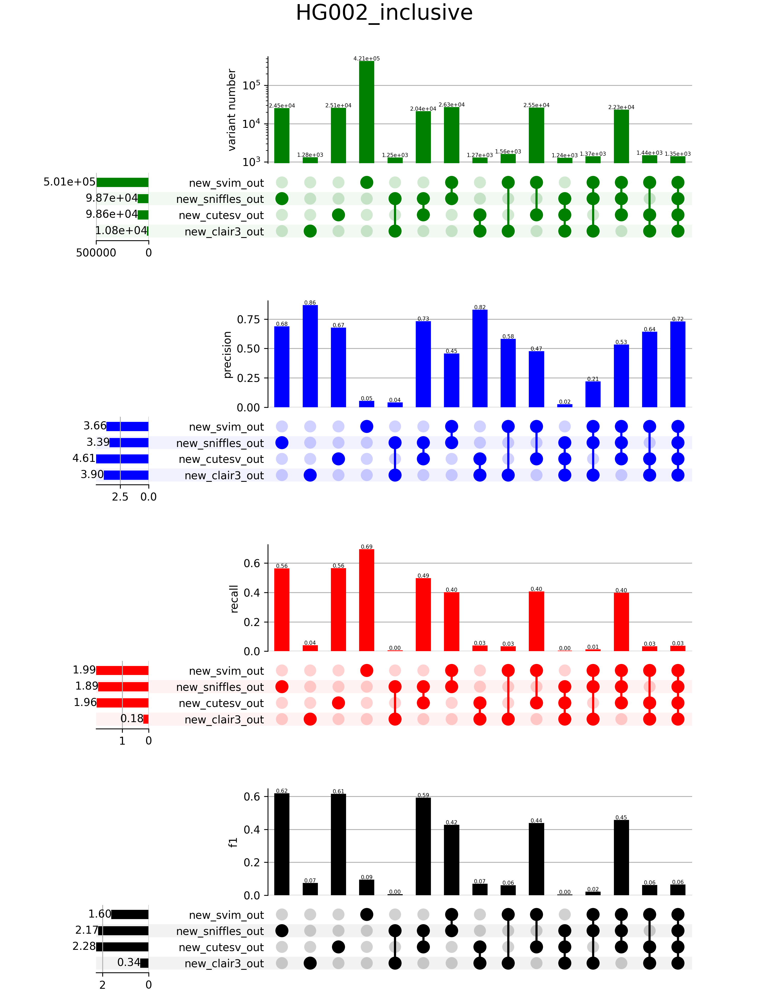

Pipeline for benchmarking variant-callers. Runs variant-callers included in
**call.wdl**, combines results using SURVIVOR, and compares combinations to
a provided truth-set. 
Variant-amount, F1-score, recall and precision of all combinations are plotted in an upsetPlot. 





Run by:
```
cromwell run bench.wdl -i inputs.json -o options.json
```

The output folder can be configured inside of **options.json**